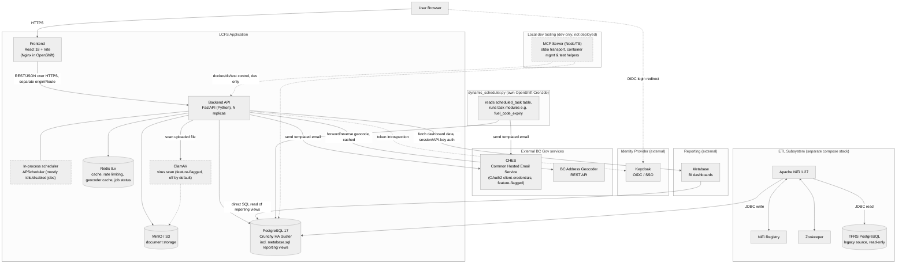

# Component Interaction Diagrams

This page documents component interaction diagrams for the LCFS system. The diagram is maintained as Mermaid source (versioned as plain text) with an exported SVG, both stored in the project root, replacing the previously static `lcfs-app-architecture.jpg`.

- **Source**: `lcfs-app-architecture.mmd`
- **Exported image**: `lcfs-app-architecture.svg`

## 1. High-Level System Architecture Diagram

**Notes / things that changed since this diagram was last drawn:**

- **RabbitMQ has been removed.** The old JPG and earlier drafts of this page listed a RabbitMQ message queue; the `rabbitmq` service no longer exists in `docker-compose.yml`, there's no `RABBITMQ_*`/AMQP config in `backend/lcfs/settings.py`, and `backend/lcfs/services/rabbitmq/` is an empty leftover directory. Async job status is now tracked via Redis instead.
- **Redis is 8.x** (`redis:8.2.1` in `docker-compose.yml`), not the `bitnami/redis:7.4.2` image referenced in older docs.
- **PostgreSQL is 17** locally (`postgres:17`) and runs as a Crunchy PostgreSQL HA cluster (`lcfs-crunchy-<env>`) in OpenShift — see `openshift/templates/knps/allow-crunchy-accept.yaml`.
- **ClamAV** exists in code (`backend/lcfs/services/clamav`, used by every document importer) but is disabled by default (`clamav_enabled: bool = False`, service commented out in `docker-compose.yml`) — it's feature-flagged per environment, not always-on.
- **CHES (Common Hosted Email Service)** is a real, previously undocumented external integration: `backend/lcfs/web/api/email/{repo,services}.py` (`CHESEmailRepository`/`CHESEmailService`) does an OAuth2 client-credentials token exchange then sends Jinja2-templated email via CHES's REST API. Feature-flagged (`ches_enabled`, off by default) and used by notifications, government notifications, and scheduled tasks (fuel code expiry, monthly credit market report).
- **BC Address Geocoder** (`backend/lcfs/services/geocoder/client.py`) is another undocumented external integration — forward/reverse geocoding and autocomplete, with a Redis-backed cache decorator.
- **Metabase** is a two-way integration, not just a dashboard link: (1) `backend/lcfs/services/metabase/client.py`'s `MetabaseClient` calls Metabase's dashboard/card REST API (session or API-key auth) to build the monthly credit-market Excel report emailed via CHES, and (2) Metabase itself connects directly to PostgreSQL to read the `metabase.sql` reporting views (`backend/lcfs/db/sql/views/metabase.sql`) for live dashboards.
- **A separate scheduling path exists beyond in-process APScheduler**: `backend/lcfs/scripts/dynamic_scheduler.py` is a standalone script (its own docstring: "Dynamic Task Scheduler for OpenShift CronJob") that reads a `scheduled_task` DB table and executes registered task modules (e.g. `tasks/fuel_code_expiry.py`) on a cron schedule — this runs as its own OpenShift workload, separate from the backend Deployment. The in-process `AsyncIOScheduler` in `backend/lcfs/services/scheduler/scheduler.py` still exists but most of its jobs are currently commented out/disabled.
- **A new `mcp-server/` (Model Context Protocol server)** was added for local AI-assisted development only. It runs over stdio, is commented out in `docker-compose.yml` by default, and is never deployed to OpenShift.

## 2. Detailed Component Diagrams (Draw.io)

- The database schema ERD is maintained separately in `LCFS_ERD_v0.3.0.drawio` (project root) — see [Database-Schema-Overview](Database-Schema-Overview.md).
- Deployment topology (Docker Compose vs. OpenShift boundaries) is covered in [Deployment-Architecture](Deployment-Architecture.md).

## 3. Data Flow Diagrams

While there is a separate [Data Flows](Data-Flows.md) page, key data flow diagrams can also be presented here as they often overlap with component interactions.
