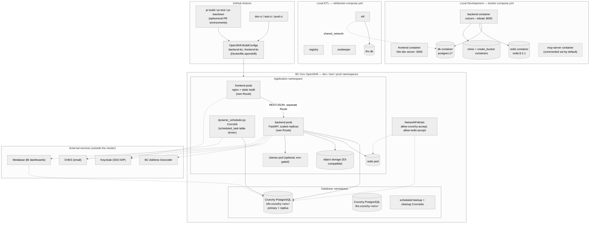

# Deployment Architecture

This document describes the deployment architecture for the LCFS system, covering local development and OpenShift (dev/test/prod) environments.

- **Diagram source**: `lcfs-deployment-architecture.mmd`
- **Exported image**: `lcfs-deployment-architecture.svg`

**Notes:**

- **Routes, the `dynamic_scheduler.py` CronJob, and the external services shown above** (Keycloak, CHES, BC Address Geocoder, Metabase) are explained in detail in section 2 ("OpenShift Deployment") below.
- **This repo does not define `Route`/`Deployment`/`CronJob` manifests** — only `BuildConfig` templates (`backend-bc.yaml`, `frontend-bc.yaml`). Those other resources are managed outside this repository.

## 1. Local Development Environment

The local development setup is defined by Docker Compose files:

- **Main Application (`./docker-compose.yml`)**: Orchestrates the core LCFS services:
  - `backend`: Python FastAPI application (`postgres:17`, `redis:8.2.1` as dependencies).
  - `frontend`: React (Vite) application.
  - `db`: PostgreSQL 17 database for LCFS data.
  - `redis`: Redis 8.2.1 for caching, rate limiting, and async job status.
  - `minio` / `create_bucket`: S3-compatible object storage plus a one-shot bucket-creation utility.
  - `mcp-server` _(commented out by default)_: a Node/TypeScript Model Context Protocol server for local AI-assisted dev tooling (container/db/test control over stdio). Explicitly dev-only and never deployed.
  - `clamav` _(commented out by default)_: virus scanning is feature-flagged (`clamav_enabled`) and off unless a given environment enables it.
  - All services are connected via a `shared_network`.
  - **Note**: `rabbitmq` is **no longer part of the stack** — it has been fully removed (no service in `docker-compose.yml`, no config in `backend/lcfs/settings.py`, and `backend/lcfs/services/rabbitmq/` is an empty leftover directory). Do not carry it forward in new diagrams/docs.
- **ETL Subsystem (`./etl/docker-compose.yml`)**: Orchestrates the services required for ETL processes:
  - `nifi` / `registry` / `zookeeper`: Apache NiFi 1.27, NiFi Registry, and Zookeeper for data flow automation and versioning.
  - `tfrs`: PostgreSQL 17 database seeded with legacy TFRS data (source for one-time/ongoing migration ETL).
  - Connects to the same `shared_network` as the main app so NiFi can reach the LCFS `db`.

## 2. OpenShift Deployment (Dev / Test / Prod)

The LCFS application is deployed to BC Gov's OpenShift Container Platform, with separate `dev`, `test`, and `prod` namespaces (and ephemeral namespaces per PR).

- **Container Images**: Custom Docker images are built for `backend` and `frontend`.
  - `Dockerfile`/`Dockerfile.dev` are used for local development builds.
  - `Dockerfile.openshift` is used by the OpenShift `BuildConfig`s.
- **Build Configuration (`openshift/templates/`)**:
  - `backend-bc.yaml` / `frontend-bc.yaml`: OpenShift `BuildConfig`s using a Docker build strategy (`dockerfilePath: ./Dockerfile.openshift`) against the repo's `backend`/`frontend` `contextDir`, parameterized by `VERSION`/`GIT_URL`/`GIT_REF` so each PR/branch can get its own image tag.
- **Serving Frontend Assets**: `frontend/nginx.conf` — Nginx serves the static Vite build in OpenShift.
- **Database**: Crunchy PostgreSQL operator manages HA clusters per environment — `lcfs-crunchy-<env>` (application data) and `tfrs-crunchy-<env>` (legacy TFRS data used by ETL/reporting). Confirmed via `openshift/templates/knps/allow-crunchy-accept.yaml`.
- **Network Policies** (`openshift/templates/knps/`):
  - `allow-crunchy-accept.yaml`: allows the app namespace to reach the Crunchy PostgreSQL instances.
  - `allow-redis-accept.yaml`: allows the app namespace to reach the Redis pod.
- **Maintenance Page**: `openshift/templates/maintenance-page/` deploys a dedicated maintenance page during outages/migrations.
- **Cleanup**: `openshift/templates/cleanup/cleanup-cron.yaml` — scheduled CronJob that removes completed/errored/orphaned pods (explicitly excludes `crunchy`/`spilo` pods from cleanup).
- **Scheduled tasks**: `backend/lcfs/scripts/dynamic_scheduler.py` is designed to run as its own OpenShift CronJob (separate from the backend Deployment), polling a `scheduled_task` DB table and executing registered task modules (e.g. fuel code expiry notifications). Its CronJob manifest is not present in this repo.
- **Routes**: not defined in this repo (only `BuildConfig`s are) — frontend and backend are served on separate Routes/origins, per the frontend's `CONFIG.API_BASE` pointing at an absolute backend URL rather than an nginx-proxied path.
- **External integrations**: Keycloak (SSO), CHES (email), the BC Address Geocoder, and Metabase (BI dashboards, which also reads reporting views directly from PostgreSQL) are all external to the cluster — see [Component-Diagrams](Component-Diagrams.md).
- **ETL Deployment**: NiFi/Registry/Zookeeper/TFRS run via the separate `etl/` Docker Compose stack (used for data migration/anonymization work), not as standard OpenShift application workloads.

## 3. CI/CD (GitHub Actions)

Defined under `.github/workflows/`:

- **PR pipeline**: `pr-build.yaml` → `pr-test.yaml` → `pr-review.yaml`, with `pr-teardown.yaml` cleaning up ephemeral per-PR OpenShift resources.
- **Environment pipelines**: `dev-ci.yml`, `test-ci.yaml`, `prod-ci.yaml` build and deploy to their respective OpenShift namespaces.
- **Supporting workflows**: `push-images-to-artifactory-repo.yaml` (image publishing), `cleanup-images.yaml`/`cleanup-images-template.yaml` (image retention), `cron-cleanup-workflow-runs.yaml`, `release-notes.yaml`, `sync-wiki.yml` (syncs `wiki/*.md` to the GitHub Wiki repo — this page included).

See [CI-CD-Pipeline](CI-CD-Pipeline.md) for more detail.
