# ERD: Compliance Domain

Focused relationship diagram for `backend/lcfs/db/models/compliance/` (29 model files). This is the most complex domain in LCFS — every compliance report fans out into multiple versioned "schedule" tables, each of which references lookup tables owned by the [Fuel domain](ERD-Fuel-Domain.md).

See also: [Fuel Domain](ERD-Fuel-Domain.md), [Organization Domain](ERD-Organization-Domain.md), [Database Schema Overview](Database-Schema-Overview.md), full schema: `LCFS_ERD_v0.3.0.drawio`.

## Scope

Included: all transactional/lookup tables that participate in FK relationships.

Excluded (reporting/materialized views with no FK relationships of their own — see model files directly for columns):
`ComplianceReportCountView`, `ComplianceReportListView`, `OrgComplianceReportCountView`, `FSEReportingBaseView`, `FSEReportingBasePrefView`, `VwFSEBaseView`, `ReportOpening`. `FinalSupplyEquipmentRegNumber` is also excluded — it's a counter table keyed by `(organization_code, postal_code)` with no FK.

Gray-equivalent **external** entities (owned by another domain, shown only because compliance tables have a direct FK to them) are called out with _(external)_ in the relationship label.

## Diagram

```mermaid
erDiagram
    COMPLIANCE_PERIOD ||--o{ COMPLIANCE_REPORT : "reporting year"
    ORGANIZATION ||--o{ COMPLIANCE_REPORT : "submitted by (external)"
    COMPLIANCE_REPORT_STATUS ||--o{ COMPLIANCE_REPORT : "current status"
    TRANSACTION |o--o{ COMPLIANCE_REPORT : "issues/credits (external)"
    USER_PROFILE |o--o{ COMPLIANCE_REPORT : "assigned analyst (external)"

    COMPLIANCE_REPORT {
        int compliance_report_id PK
        int compliance_period_id FK
        int organization_id FK
        int current_status_id FK
        int transaction_id FK
        string compliance_report_group_uuid
        int version
        int assigned_analyst_id FK
    }

    COMPLIANCE_REPORT ||--o| COMPLIANCE_REPORT_SUMMARY : "has"
    COMPLIANCE_REPORT ||--o{ COMPLIANCE_REPORT_HISTORY : "status trail"
    COMPLIANCE_REPORT_STATUS ||--o{ COMPLIANCE_REPORT_HISTORY : "status"
    USER_PROFILE |o--o{ COMPLIANCE_REPORT_HISTORY : "changed by (external)"
    COMPLIANCE_REPORT ||--o| COMPLIANCE_REPORT_ORGANIZATION_SNAPSHOT : "audit snapshot"
    COMPLIANCE_REPORT_SUMMARY ||--o{ COMPLIANCE_REPORT_PENALTY_STATUS_HISTORY : "invoice/payment log"
    USER_PROFILE |o--o{ COMPLIANCE_REPORT_PENALTY_STATUS_HISTORY : "changed by (external)"
    DOCUMENT }o--o{ COMPLIANCE_REPORT : "attachments (external, assoc. table)"

    COMPLIANCE_REPORT_SUMMARY {
        int summary_id PK
        int compliance_report_id FK
        int quarter
        bool is_locked
    }

    COMPLIANCE_REPORT ||--o{ NOTIONAL_TRANSFER : "schedule"
    NOTIONAL_TRANSFER {
        int notional_transfer_id PK
        int compliance_report_id FK
        string legal_name
    }

    COMPLIANCE_REPORT ||--o{ FUEL_SUPPLY : "schedule"
    FUEL_SUPPLY {
        int fuel_supply_id PK
        int compliance_report_id FK
        int fuel_type_id FK
        int fuel_category_id FK
        int fuel_code_id FK
        int provision_of_the_act_id FK
        int end_use_id FK
    }
    FUEL_TYPE ||--o{ FUEL_SUPPLY : "(external)"
    FUEL_CATEGORY ||--o{ FUEL_SUPPLY : "(external)"
    FUEL_CODE |o--o{ FUEL_SUPPLY : "(external)"
    PROVISION_OF_THE_ACT ||--o{ FUEL_SUPPLY : "(external)"
    END_USE_TYPE |o--o{ FUEL_SUPPLY : "(external)"

    COMPLIANCE_REPORT ||--o{ FUEL_EXPORT : "schedule"
    FUEL_EXPORT {
        int fuel_export_id PK
        int compliance_report_id FK
        int fuel_type_id FK
        int fuel_category_id FK
        int fuel_code_id FK
        int provision_of_the_act_id FK
        int end_use_id FK
    }
    FUEL_TYPE ||--o{ FUEL_EXPORT : "(external)"
    FUEL_CATEGORY ||--o{ FUEL_EXPORT : "(external)"
    FUEL_CODE |o--o{ FUEL_EXPORT : "(external)"
    PROVISION_OF_THE_ACT ||--o{ FUEL_EXPORT : "(external)"
    END_USE_TYPE |o--o{ FUEL_EXPORT : "(external)"

    COMPLIANCE_REPORT ||--o{ ALLOCATION_AGREEMENT : "schedule"
    ALLOCATION_AGREEMENT {
        int allocation_agreement_id PK
        int compliance_report_id FK
        int allocation_transaction_type_id FK
        int fuel_type_id FK
        int fuel_category_id FK
        int provision_of_the_act_id FK
        int fuel_code_id FK
    }
    ALLOCATION_TRANSACTION_TYPE ||--o{ ALLOCATION_AGREEMENT : "transaction type"
    FUEL_TYPE ||--o{ ALLOCATION_AGREEMENT : "(external)"
    FUEL_CATEGORY |o--o{ ALLOCATION_AGREEMENT : "(external)"
    FUEL_CODE |o--o{ ALLOCATION_AGREEMENT : "(external)"
    PROVISION_OF_THE_ACT |o--o{ ALLOCATION_AGREEMENT : "(external)"

    COMPLIANCE_REPORT ||--o{ OTHER_USES : "schedule"
    OTHER_USES {
        int other_uses_id PK
        int compliance_report_id FK
        int fuel_type_id FK
        int fuel_category_id FK
        int provision_of_the_act_id FK
        int fuel_code_id FK
        int expected_use_id FK
    }
    FUEL_TYPE ||--o{ OTHER_USES : "(external)"
    FUEL_CATEGORY ||--o{ OTHER_USES : "(external)"
    FUEL_CODE |o--o{ OTHER_USES : "(external)"
    PROVISION_OF_THE_ACT ||--o{ OTHER_USES : "(external)"
    EXPECTED_USE_TYPE ||--o{ OTHER_USES : "(external)"

    COMPLIANCE_REPORT ||--o{ FINAL_SUPPLY_EQUIPMENT : "schedule (FSE)"
    FINAL_SUPPLY_EQUIPMENT {
        int final_supply_equipment_id PK
        int compliance_report_id FK
        int level_of_equipment_id FK
        string registration_nbr
    }
    LEVEL_OF_EQUIPMENT ||--o{ FINAL_SUPPLY_EQUIPMENT : "level"
    FINAL_SUPPLY_EQUIPMENT }o--o{ END_USE_TYPE : "intended use (assoc.)"
    FINAL_SUPPLY_EQUIPMENT }o--o{ END_USER_TYPE : "intended user (assoc.)"

    ORGANIZATION ||--o{ CHARGING_SITE : "owns (external)"
    ORGANIZATION |o--o{ CHARGING_SITE : "allocating org (external)"
    CHARGING_SITE_STATUS ||--o{ CHARGING_SITE : "status"
    CHARGING_SITE {
        int charging_site_id PK
        int organization_id FK
        int allocating_organization_id FK
        int status_id FK
        string site_code
    }
    CHARGING_SITE ||--o{ CHARGING_EQUIPMENT : "has"
    CHARGING_EQUIPMENT_STATUS ||--o{ CHARGING_EQUIPMENT : "status"
    CHARGING_EQUIPMENT {
        int charging_equipment_id PK
        int charging_site_id FK
        int status_id FK
        string equipment_number
    }
    CHARGING_EQUIPMENT }o--o{ END_USE_TYPE : "intended use (assoc.)"
    CHARGING_EQUIPMENT }o--o{ END_USER_TYPE : "intended user (assoc.)"

    END_USE_TYPE ||--o{ CHARGING_POWER_OUTPUT : "end use"
    END_USER_TYPE ||--o{ CHARGING_POWER_OUTPUT : "end user"
    LEVEL_OF_EQUIPMENT ||--o{ CHARGING_POWER_OUTPUT : "level"
    CHARGING_POWER_OUTPUT {
        int charging_power_output_id PK
        int end_use_type_id FK
        int end_user_type_id FK
        int level_of_equipment_id FK
    }

    CHARGING_EQUIPMENT ||--o{ COMPLIANCE_REPORT_CHARGING_EQUIPMENT : "reported via"
    COMPLIANCE_REPORT ||--o{ COMPLIANCE_REPORT_CHARGING_EQUIPMENT : "reported via"
    ORGANIZATION ||--o{ COMPLIANCE_REPORT_CHARGING_EQUIPMENT : "(external)"
    COMPLIANCE_REPORT_CHARGING_EQUIPMENT {
        int charging_equipment_compliance_id PK
        int charging_equipment_id FK
        int compliance_report_id FK
        int organization_id FK
        string compliance_report_group_uuid
    }
```

## Notes

- **`ComplianceReport` is the hub**: every "schedule" table (`FuelSupply`, `FuelExport`, `NotionalTransfer`, `OtherUses`, `AllocationAgreement`, `FinalSupplyEquipment`, `ComplianceReportChargingEquipment`) is a direct child of `ComplianceReport`, not of each other. Supplemental reports create a new `ComplianceReport` row (same `compliance_report_group_uuid`, incremented `version`) with its own full set of schedule rows — schedules are **not** shared/mutated across versions.
- `FuelSupply`/`FuelExport`/`AllocationAgreement`/`OtherUses` all repeat the same four-way lookup pattern (`FuelType`, `FuelCategory`, `FuelCode`, `ProvisionOfTheAct`) — see [Fuel Domain](ERD-Fuel-Domain.md) for how those lookups relate to each other.
- Charging infrastructure (`ChargingSite` → `ChargingEquipment` → `ChargingPowerOutput`) is versioned independently of compliance reports; `ComplianceReportChargingEquipment` is the join that pins a specific `(charging_equipment_id, charging_equipment_version)` to a specific `(compliance_report_id, version)` for a supply period.
- `ComplianceReportPenaltyStatusHistory` hangs off `ComplianceReportSummary`, not `ComplianceReport`, because penalty invoice/payment status is tracked per summary line.
