# ERD: Fuel Domain

Focused relationship diagram for `backend/lcfs/db/models/fuel/` (22 model files). This domain is the shared "reference data" layer — `FuelType`, `FuelCategory`, `FuelCode` and their carbon-intensity/energy lookups are read by nearly every schedule in the [Compliance domain](ERD-Compliance-Domain.md).

See also: [Compliance Domain](ERD-Compliance-Domain.md), [Organization Domain](ERD-Organization-Domain.md), [Database Schema Overview](Database-Schema-Overview.md), full schema: `LCFS_ERD_v0.3.0.drawio`.

## Scope

Excluded (reporting/materialized views with no FK relationships of their own): `FuelCodeCountView`, `FuelCodeListView`.

## Diagram

```mermaid
erDiagram
    PROVISION_OF_THE_ACT |o--o{ FUEL_TYPE : "provision_1_id / provision_2_id (x2)"
    FUEL_TYPE {
        int fuel_type_id PK
        string fuel_type
        bool fossil_derived
        bool renewable
        int provision_1_id FK
        int provision_2_id FK
    }

    FUEL_TYPE ||--o{ FUEL_INSTANCE : "valid combo"
    FUEL_CATEGORY ||--o{ FUEL_INSTANCE : "valid combo"
    FUEL_INSTANCE {
        int fuel_instance_id PK
        int fuel_type_id FK
        int fuel_category_id FK
    }
    FUEL_CATEGORY {
        int fuel_category_id PK
        string category
        numeric default_carbon_intensity
    }

    FUEL_CODE_STATUS ||--o{ FUEL_CODE : "status"
    FUEL_CODE_PREFIX ||--o{ FUEL_CODE : "prefix (e.g. BCLCF)"
    FUEL_TYPE ||--o{ FUEL_CODE : "fuel_type_id"
    ORGANIZATION |o--o{ FUEL_CODE : "owning org (external, nullable)"
    FUEL_CODE {
        int fuel_code_id PK
        int fuel_status_id FK
        int prefix_id FK
        int fuel_type_id FK
        int organization_id FK
        string fuel_suffix
        numeric carbon_intensity
    }
    FUEL_CODE ||--o{ FUEL_CODE_HISTORY : "status change log"
    FUEL_CODE_STATUS ||--o{ FUEL_CODE_HISTORY : "status"
    FUEL_CODE ||--o{ FEEDSTOCK_FUEL_TRANSPORT_MODE : "feedstock transport"
    TRANSPORT_MODE ||--o{ FEEDSTOCK_FUEL_TRANSPORT_MODE : "mode"
    FUEL_CODE ||--o{ FINISHED_FUEL_TRANSPORT_MODE : "finished fuel transport"
    TRANSPORT_MODE ||--o{ FINISHED_FUEL_TRANSPORT_MODE : "mode"
    CI_APPLICATION_FUEL_CODE_ASSOCIATION }o--|| FUEL_CODE : "used in CI application (external)"

    FUEL_TYPE ||--o{ ENERGY_DENSITY : "fuel_type_id"
    UNIT_OF_MEASURE ||--o{ ENERGY_DENSITY : "uom"
    COMPLIANCE_PERIOD ||--o{ ENERGY_DENSITY : "effective period (external)"

    FUEL_CATEGORY ||--o{ ENERGY_EFFECTIVENESS_RATIO : "fuel_category_id"
    FUEL_TYPE |o--o{ ENERGY_EFFECTIVENESS_RATIO : "fuel_type_id"
    END_USE_TYPE |o--o{ ENERGY_EFFECTIVENESS_RATIO : "end_use_type_id"
    COMPLIANCE_PERIOD ||--o{ ENERGY_EFFECTIVENESS_RATIO : "effective period (external)"

    FUEL_TYPE |o--o{ ADDITIONAL_CARBON_INTENSITY : "fuel_type_id"
    END_USE_TYPE |o--o{ ADDITIONAL_CARBON_INTENSITY : "end_use_type_id"
    UNIT_OF_MEASURE ||--o{ ADDITIONAL_CARBON_INTENSITY : "uom"
    COMPLIANCE_PERIOD ||--o{ ADDITIONAL_CARBON_INTENSITY : "effective period (external)"

    FUEL_TYPE ||--o{ DEFAULT_CARBON_INTENSITY : "fuel_type_id"
    COMPLIANCE_PERIOD ||--o{ DEFAULT_CARBON_INTENSITY : "compliance_period_id (external)"

    FUEL_CATEGORY ||--o{ CATEGORY_CARBON_INTENSITY : "fuel_category_id"
    COMPLIANCE_PERIOD ||--o{ CATEGORY_CARBON_INTENSITY : "compliance_period_id (external)"

    FUEL_CATEGORY ||--o{ TARGET_CARBON_INTENSITY : "fuel_category_id"
    COMPLIANCE_PERIOD ||--o{ TARGET_CARBON_INTENSITY : "compliance_period_id (external)"
```

## Notes

- `FuelInstance` is the join table that says "this `FuelType` is valid under this `FuelCategory`" — it carries no other data.
- `FuelType.provision_1_id` / `provision_2_id` are two independent nullable FKs to the **same** `ProvisionOfTheAct` table (default/secondary provisions for CI lookups).
- The five carbon-intensity/energy tables (`EnergyDensity`, `EnergyEffectivenessRatio`, `AdditionalCarbonIntensity`, `DefaultCarbonIntensity`, `CategoryCarbonIntensity`, `TargetCarbonIntensity`) are all effective-dated by `CompliancePeriod` (external — see [Compliance Domain](ERD-Compliance-Domain.md)) and keyed by some combination of `FuelType`/`FuelCategory`/`EndUseType`. These are the tables government staff maintain each compliance year.
- `FuelType`, `FuelCategory`, `FuelCode`, `ProvisionOfTheAct`, `EndUseType`, `ExpectedUseType` are also referenced extensively from Compliance Reporting schedules (`FuelSupply`, `FuelExport`, `AllocationAgreement`, `OtherUses`) — those edges are drawn on the [Compliance Domain](ERD-Compliance-Domain.md) diagram rather than duplicated here.
- `FuelCode.organization_id` uses `ondelete="SET NULL"` — a fuel code survives if its owning organization is deleted (non-registered producers have no organization).
