# ERD: Organization Domain

Focused relationship diagram for `backend/lcfs/db/models/organization/` (10 model files, plus one DB-view-backed class). `Organization` is the central actor in LCFS — nearly every other domain (compliance, transactions, transfers, fuel codes, CI applications, charging infrastructure) hangs a record off an `organization_id`.

See also: [Compliance Domain](ERD-Compliance-Domain.md), [Fuel Domain](ERD-Fuel-Domain.md), [Database Schema Overview](Database-Schema-Overview.md), full schema: `LCFS_ERD_v0.3.0.drawio`.

## Scope

`OrganizationBalance` (`organization_balance_view`) is **not** a real table — it's a SQLAlchemy-mapped read-only view aggregating `transaction` rows per organization (current compliance unit balance). It has no FK and is shown as a note only.

## Diagram

```mermaid
erDiagram
    ORGANIZATION_STATUS ||--o{ ORGANIZATION : "status"
    ORGANIZATION_TYPE ||--o{ ORGANIZATION : "primary type"
    ORGANIZATION_ADDRESS |o--|| ORGANIZATION : "address"
    ORGANIZATION_ATTORNEY_ADDRESS |o--|| ORGANIZATION : "attorney address"
    ORGANIZATION {
        int organization_id PK
        string organization_code UK
        string name
        int organization_status_id FK
        int organization_type_id FK
        int organization_address_id FK
        int organization_attorney_address_id FK
        bigint total_balance
        bigint reserved_balance
        bool credit_trading_enabled
    }

    ORGANIZATION }o--o{ ORGANIZATION_TYPE : "additional types (assoc. table)"
    ORGANIZATION_TYPE_ASSOCIATION {
        int organization_type_association_id PK
        int organization_id FK
        int organization_type_id FK
    }

    ORGANIZATION }o--o{ ROLE : "org-controllable roles (external, assoc. table)"
    ORGANIZATION_AVAILABLE_ROLE {
        int organization_available_role_id PK
        int organization_id FK
        int role_id FK
    }

    ORGANIZATION ||--o{ ORGANIZATION_EARLY_ISSUANCE_BY_YEAR : "opt-in per period"
    COMPLIANCE_PERIOD ||--o{ ORGANIZATION_EARLY_ISSUANCE_BY_YEAR : "(external)"

    ORGANIZATION ||--o{ ORGANIZATION_LINK_KEY : "anonymous form access"
    FORM ||--o{ ORGANIZATION_LINK_KEY : "(external)"

    ORGANIZATION ||--o{ PENALTY_LOG : "penalty assessments"
    COMPLIANCE_PERIOD ||--o{ PENALTY_LOG : "(external)"

    ORGANIZATION ||--o{ CREDIT_MARKET_AUDIT_LOG : "credit market listing change log"

    ORGANIZATION ||--o{ USER_PROFILE : "users (external)"
    ORGANIZATION ||--o{ TRANSACTION : "ledger entries (external)"
    ORGANIZATION ||--o{ COMPLIANCE_REPORT : "submits (external)"
    ORGANIZATION ||--o{ ADMIN_ADJUSTMENT : "to_organization (external)"
    ORGANIZATION ||--o{ INITIATIVE_AGREEMENT : "to_organization (external)"
    ORGANIZATION ||--o{ TRANSFER : "from/to_organization (external, x2 FKs)"
    ORGANIZATION ||--o{ NOTIFICATION_MESSAGE : "related org (external)"
    ORGANIZATION ||--o{ CHARGING_SITE : "owns / allocates (external, x2 FKs)"
    ORGANIZATION ||--o{ COMPLIANCE_REPORT_CHARGING_EQUIPMENT : "(external)"
    ORGANIZATION ||--o{ CI_APPLICATION : "(external)"
    ORGANIZATION |o--o{ FUEL_CODE : "owning producer (external)"
```

## Notes

- `ORGANIZATION_TYPE_ASSOCIATION` is a many-to-many join that was added to let an organization hold **multiple** types (#4565); `Organization.organization_type_id` (the single FK, `org_type` relationship) is kept dual-written alongside it until reporting views migrate off the single-FK column — don't assume one implies the other is unused.
- `ORGANIZATION_AVAILABLE_ROLE` only stores _org-controllable_ roles (e.g. roles a BCeID admin can grant to their own users); base roles like "Manage Users"/"Signing Authority" are always available and aren't rows here.
- `ORGANIZATION_ADDRESS` / `ORGANIZATION_ATTORNEY_ADDRESS` are 1:1 with `Organization` (each address row only ever points back to the one organization that owns it via `back_populates`, `uselist=False`).
- The bottom block of the diagram (`USER_PROFILE` through `FUEL_CODE`) lists **incoming** one-hop references from other domains so you can see at a glance who depends on `Organization` — those entities' own internal relationships are covered on their respective domain pages (e.g. [Compliance Domain](ERD-Compliance-Domain.md) for `ComplianceReport`/`ChargingSite`/`ComplianceReportChargingEquipment`, [Fuel Domain](ERD-Fuel-Domain.md) for `FuelCode`).
- `OrganizationBalance` (`organization_balance_view`): read-only, maps `organization_id` → current `compliance_units` balance, computed from the `transaction` table. No FK to model — do not add relationships to it.
